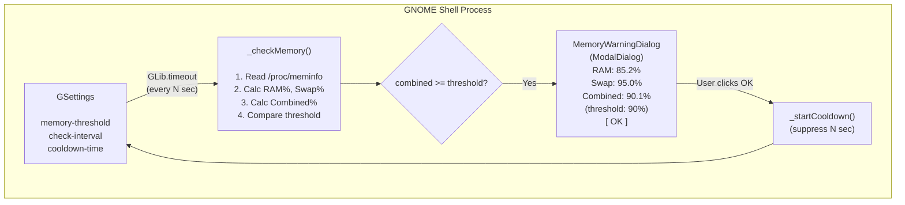
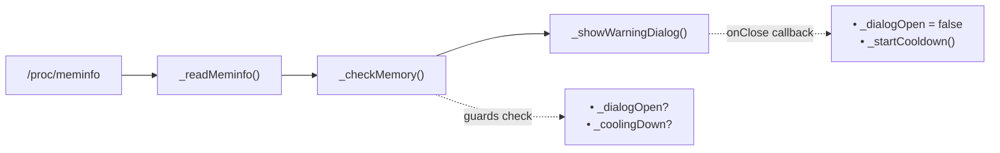
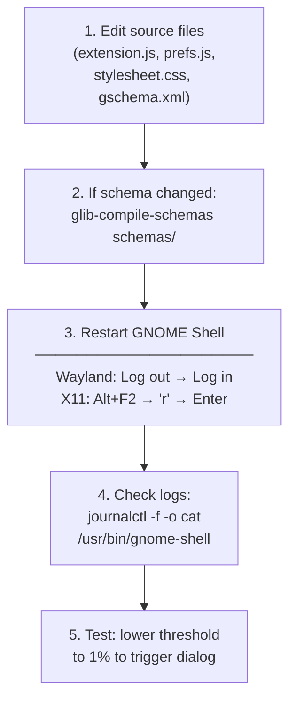

# Development Guide — System Memory Guard

> Comprehensive guide for developing, debugging, and contributing to the **System Memory Guard** GNOME Shell extension.

---

## Table of Contents

- [Prerequisites](#prerequisites)
- [Environment Setup](#environment-setup)
- [Project Structure](#project-structure)
- [Architecture Overview](#architecture-overview)
- [Code Walkthrough](#code-walkthrough)
  - [extension.js — Core Logic](#extensionjs--core-logic)
  - [prefs.js — Preferences UI](#prefsjs--preferences-ui)
  - [GSettings Schema](#gsettings-schema)
  - [stylesheet.css — Dialog Styling](#stylesheetcss--dialog-styling)
- [Development Workflow](#development-workflow)
- [Debugging](#debugging)
- [Testing](#testing)
- [GSettings Management](#gsettings-management)
- [Packaging & Distribution](#packaging--distribution)
- [Coding Conventions](#coding-conventions)
- [Troubleshooting](#troubleshooting)

---

## Prerequisites

| Requirement              | Version        | Notes                                                |
| ------------------------ | -------------- | ---------------------------------------------------- |
| **GNOME Shell**          | 45, 46, 47, 48 | Extension uses ESM module system (GNOME 45+)         |
| **GJS**                  | ≥ 1.76         | Ships with GNOME 45+                                 |
| **Linux Kernel**         | ≥ 3.14         | Required for `MemAvailable` field in `/proc/meminfo` |
| **libadwaita**           | ≥ 1.0          | Required for preferences UI (`Adw.SpinRow`)          |
| **glib-compile-schemas** | any            | Part of `glib2-dev` / `libglib2.0-dev` package       |
| **Git**                  | any            | Version control                                      |

### Install Development Dependencies

```bash
# Fedora / RHEL
sudo dnf install gnome-shell gjs glib2-devel gnome-extensions-app

# Ubuntu / Debian
sudo apt install gnome-shell gjs libglib2.0-dev gnome-shell-extension-prefs

# Arch Linux
sudo pacman -S gnome-shell gjs glib2 gnome-extensions-app
```

> **No external JavaScript dependencies.** This extension runs entirely on GNOME Shell built-in libraries (`GLib`, `GObject`, `St`, `Clutter`, `Gio`, `Adw`, `Gtk`). There is no `node_modules`, no `package.json`, no bundler.

---

## Environment Setup

### 1. Clone and Link

```bash
# Clone the repository
git clone https://github.com/haiphamngoc-dev/memory-guard.git
cd memory-guard

# Compile the GSettings schema
glib-compile-schemas schemas/

# Symlink into GNOME's extension directory
ln -sf "$(pwd)" \
  ~/.local/share/gnome-shell/extensions/memory-guard@haiphamngoc.dev
```

### 2. Enable the Extension

```bash
# Restart GNOME Shell first:
#   • Wayland: Log out → Log back in
#   • X11:     Alt+F2 → type 'r' → Enter

# Then enable
gnome-extensions enable memory-guard@haiphamngoc.dev
```

### 3. Verify Installation

```bash
gnome-extensions info memory-guard@haiphamngoc.dev
```

Expected output:

```text
memory-guard@haiphamngoc.dev
  Name: System Memory Guard
  Description: Monitors RAM and Swap usage in real-time...
  State: ACTIVE
```

---

## Project Structure

```text
memory-guard/
├── metadata.json                                              # Extension identity & GNOME version compat
├── extension.js                                               # Core: polling, /proc/meminfo, modal dialog
├── prefs.js                                                   # Preferences UI (libadwaita, separate process)
├── stylesheet.css                                             # St (Shell Toolkit) CSS for the dialog
├── schemas/
│   ├── org.gnome.shell.extensions.memory-guard.gschema.xml    # GSettings schema definition
│   └── gschemas.compiled                                      # Compiled binary (auto-generated)
├── README.md                                                  # User-facing documentation
├── DEVELOPMENT.md                                             # This file
└── LICENSE                                                    # GPL-3.0
```

### Key File Roles

| File             | Process            | Purpose                                                                  |
| ---------------- | ------------------ | ------------------------------------------------------------------------ |
| `extension.js`   | GNOME Shell (main) | Runs inside `gnome-shell` — has access to `St`, `Clutter`, `ModalDialog` |
| `prefs.js`       | Separate process   | Runs in `gnome-extensions-app` — has access to `Adw`, `Gtk`, `Gio`       |
| `stylesheet.css` | GNOME Shell (main) | Loaded by Shell's CSS engine (St toolkit), **not** standard CSS          |
| `metadata.json`  | Both               | Parsed by GNOME Shell to register the extension                          |
| `gschema.xml`    | Compile-time       | Defines settings keys; compiled to binary by `glib-compile-schemas`      |

> ⚠️ **Important**: `extension.js` and `prefs.js` run in **different processes**. They share data only through GSettings — you cannot pass variables directly between them.

---

## Architecture Overview



### Data Flow



### Warning Trigger Formula

```text
Combined% = (RAM_used + Swap_used) / (RAM_total + Swap_total) × 100

Where:
  RAM_used  = MemTotal − MemAvailable
  Swap_used = SwapTotal − SwapFree

Dialog shown when: Combined% ≥ memory-threshold
```

---

## Code Walkthrough

### extension.js — Core Logic

This file contains two classes:

#### 1. `MemoryWarningDialog` (GObject class)

A modal dialog that extends `ModalDialog.ModalDialog`. Registered with `GObject.registerClass()` as required by GNOME Shell's type system.

```text
MemoryWarningDialog
├── constructor({ramPercent, swapPercent, combinedPercent, memoryThreshold, onClose})
│   ├── Creates St.BoxLayout (vertical content container)
│   ├── St.Icon        — dialog-warning-symbolic, 64px, red
│   ├── St.Label       — title: "⚠ System Memory Warning"
│   ├── St.Label       — body: descriptive message
│   ├── St.Label       — percent: RAM%, Swap%, Combined% (threshold: X%)
│   └── addButton("OK") — the ONLY way to dismiss
│
└── _dismiss()
    ├── this.close()        — triggers popModal + fade-out
    └── this._onClose?.()   — notifies extension to start cool-down
```

**Why `GObject.registerClass()`?** GNOME Shell's `ModalDialog` uses GObject signals and properties internally. Without registration, the class cannot participate in the GObject type system, causing crashes.

#### 2. `MemoryGuardExtension` (Extension class)

The main extension class with a complete lifecycle:

```text
MemoryGuardExtension
│
├── enable()                    — Entry point, called by GNOME Shell
│   ├── Load GSettings
│   ├── Init state flags (dialogOpen, coolingDown, sourceIds)
│   └── _startLoop()
│
├── disable()                   — Cleanup, called on lock/logout/disable
│   ├── _stopLoop()             — Remove polling timer
│   ├── _clearCooldown()        — Remove cooldown timer
│   ├── Close any open dialog
│   └── Null all references
│
├── POLLING LOOP
│   ├── _startLoop()            — GLib.timeout_add_seconds (repeating)
│   └── _stopLoop()             — GLib.source_remove
│
├── COOL-DOWN
│   ├── _startCooldown()        — One-shot timer after dialog dismiss
│   └── _clearCooldown()        — Cancel timer on disable
│
├── MEMORY READING
│   └── _readMeminfo()          — Parse /proc/meminfo → {memTotal, memAvailable, swapTotal, swapFree}
│
└── CHECK + TRIGGER
    ├── _checkMemory()          — Core: read → calculate → compare → show
    └── _showWarningDialog()    — Create + open MemoryWarningDialog
```

#### Critical Design Decisions

1. **`MemAvailable` over `MemFree`**: `MemFree` shows only completely unused pages. `MemAvailable` (Linux 3.14+) accounts for reclaimable buffers/cache, giving a realistic "available to applications" figure.

2. **Combined threshold**: Uses `(RAM_used + Swap_used) / (RAM_total + Swap_total)` instead of checking RAM and Swap separately. This avoids false positives when only Swap is high but the system has plenty of RAM.

3. **`destroyOnClose: true`**: Ensures the dialog GObject is fully destroyed after dismissal, preventing GJS memory leaks from stale references.

4. **Source ID tracking**: Every `GLib.timeout_add_seconds()` stores its source ID. `disable()` removes all sources — critical because GNOME Shell calls `disable()` on screen lock (GNOME 42+).

---

### prefs.js — Preferences UI

Runs in a **separate process** (`gnome-extensions-app`), not inside `gnome-shell`.

```text
MemoryGuardPreferences (extends ExtensionPreferences)
│
└── fillPreferencesWindow(window)
    │
    ├── Adw.PreferencesPage ("Memory Guard")
    │
    ├── GROUP 1: Warning Thresholds
    │   └── Adw.SpinRow "Memory Threshold"  ←→  GSettings "memory-threshold"
    │       (50-100%, step: 1, page: 5)
    │
    └── GROUP 2: Timing
        ├── Adw.SpinRow "Check Interval"    ←→  GSettings "check-interval"
        │   (1-30 sec, step: 1, page: 5)
        │
        └── Adw.SpinRow "Cool-down Time"    ←→  GSettings "cooldown-time"
            (10-600 sec, step: 5, page: 30)
```

**Binding mechanism**: `settings.bind()` with `Gio.SettingsBindFlags.DEFAULT` creates a **two-way binding** — UI changes update GSettings immediately, and GSettings changes (e.g., from CLI) update the UI.

---

### GSettings Schema

**File**: `schemas/org.gnome.shell.extensions.memory-guard.gschema.xml`

| Key                | Type  | Default | Range  | Description                                         |
| ------------------ | ----- | ------- | ------ | --------------------------------------------------- |
| `memory-threshold` | `int` | `90`    | 50-100 | Combined (RAM+Swap) threshold that triggers warning |
| `check-interval`   | `int` | `3`     | 1-30   | Seconds between `/proc/meminfo` reads               |
| `cooldown-time`    | `int` | `60`    | 10-600 | Seconds to suppress dialog after dismissal          |

**After modifying the schema**, you MUST recompile:

```bash
glib-compile-schemas schemas/
```

The compiled binary `gschemas.compiled` is generated from the XML and must be committed to the repository (GNOME Shell reads the binary, not the XML, when using `--schemadir`).

---

### stylesheet.css — Dialog Styling

This is **St (Shell Toolkit) CSS**, not standard web CSS. St supports a subset of CSS properties. Key differences from standard CSS:

| Feature           | St CSS                            | Standard CSS        |
| ----------------- | --------------------------------- | ------------------- |
| Icon sizing       | `icon-size: 64px`                 | `width: 64px`       |
| Font size         | `font-size: 18pt`                 | `font-size: 18pt`   |
| Box model         | Similar but limited               | Full box model      |
| Animations        | Limited (use Clutter transitions) | Full CSS animations |
| Selectors         | Basic (class, child)              | Full CSS selectors  |
| Custom properties | ❌ Not supported                  | ✅ `var(--custom)`  |
| Flexbox / Grid    | ❌ Not supported                  | ✅ Fully supported  |

**Current style classes**:

```css
.memory-guard-dialog .modal-dialog-content-box  /* Container: padding */
.memory-guard-icon                               /* Icon: 64px, red (#e74c3c) */
.memory-guard-title                              /* Title: 18pt bold, red */
.memory-guard-body                               /* Body: 11pt, light gray (#deddda) */
.memory-guard-percent                            /* Stats: 13pt bold, yellow (#f9e44c) */
```

> **Tip**: To test CSS changes without restarting the shell, use Looking Glass (`Alt+F2 → lg → Enter`) and run:
>
> ```js
> St.ThemeContext.get_for_stage(global.stage)
>   .get_theme()
>   .load_stylesheet(Gio.File.new_for_path("/path/to/stylesheet.css"));
> ```

---

## Development Workflow

### Quick Iteration Cycle



### Nested GNOME Shell (X11 Only)

For rapid iteration without logging out:

```bash
dbus-run-session -- gnome-shell --nested --wayland
```

This opens a GNOME Shell window inside your current session. Install and enable the extension inside the nested session for isolated testing.

### Testing Preferences UI

```bash
# Open preferences window directly
gnome-extensions prefs memory-guard@haiphamngoc.dev

# Or launch the GNOME Extensions app
gnome-extensions-app
```

---

## Debugging

### Log Output

GNOME Shell extensions log to the systemd journal:

```bash
# All GNOME Shell logs (real-time)
journalctl -f -o cat /usr/bin/gnome-shell

# Filter Memory Guard messages only
journalctl -f -o cat /usr/bin/gnome-shell | grep -i "MemoryGuard"

# View recent logs (last 5 minutes)
journalctl --since "5 min ago" -o cat /usr/bin/gnome-shell
```

### Adding Debug Logs

Use `console.log()` or `logError()` inside `extension.js`:

```javascript
// Standard log — appears in journal
console.log("MemoryGuard: RAM usage =", ramPercent.toFixed(1), "%");

// Error log — includes stack trace
try {
  // ...
} catch (e) {
  logError(e, "MemoryGuard: failed to do something");
}
```

### Looking Glass (Built-in Debugger)

Press `Alt+F2`, type `lg`, press Enter. This opens GNOME Shell's JavaScript console.

Useful commands:

```javascript
// Check if extension is loaded
const ext =
  imports.misc.extensionUtils.extensions["memory-guard@haiphamngoc.dev"];

// Inspect extension state
ext._dialogOpen;
ext._coolingDown;

// Read current memory info
ext._readMeminfo();

// Manually trigger a memory check
ext._checkMemory();
```

### Common Error Patterns

| Error Message                             | Cause                             | Fix                                       |
| ----------------------------------------- | --------------------------------- | ----------------------------------------- |
| `GLib.Error: ... no such schema`          | Schema not compiled               | Run `glib-compile-schemas schemas/`       |
| `TypeError: ... is not a constructor`     | Missing `GObject.registerClass()` | Wrap class with `GObject.registerClass()` |
| `Error: Unable to create modal dialog`    | Dialog created during `disable()` | Check `_dialogOpen` flag before creating  |
| `GLib-GObject: ... invalid property name` | Typo in GSettings key name        | Verify key exists in `gschema.xml`        |
| `Extension ... had error: SyntaxError`    | JavaScript syntax error           | Check `journalctl` for file/line number   |

---

## Testing

### Trigger Warning Dialog Manually

Lower the threshold to force the dialog to appear:

```bash
# Set threshold to 1% — will trigger on next check cycle
gsettings --schemadir schemas/ set \
  org.gnome.shell.extensions.memory-guard memory-threshold 1

# Wait for the dialog, dismiss it, then reset
gsettings --schemadir schemas/ set \
  org.gnome.shell.extensions.memory-guard memory-threshold 90
```

### Verify Current Memory Readings

Check what the extension would see:

```bash
# View raw /proc/meminfo
cat /proc/meminfo | grep -E "^(MemTotal|MemAvailable|SwapTotal|SwapFree)"

# Calculate combined usage manually
awk '
  /^MemTotal:/     { ram_total = $2 }
  /^MemAvailable:/ { ram_avail = $2 }
  /^SwapTotal:/    { swap_total = $2 }
  /^SwapFree:/     { swap_free = $2 }
  END {
    ram_used  = ram_total - ram_avail
    swap_used = swap_total - swap_free
    total     = ram_total + swap_total
    used      = ram_used + swap_used
    printf "RAM:      %.1f%%\n", (ram_used / ram_total) * 100
    printf "Swap:     %.1f%%\n", (swap_total > 0 ? (swap_used / swap_total) * 100 : 0)
    printf "Combined: %.1f%%\n", (total > 0 ? (used / total) * 100 : 0)
  }
' /proc/meminfo
```

### Test Cool-down Behavior

```bash
# Set a very short cool-down for testing
gsettings --schemadir schemas/ set \
  org.gnome.shell.extensions.memory-guard cooldown-time 10

# Set a fast check interval
gsettings --schemadir schemas/ set \
  org.gnome.shell.extensions.memory-guard check-interval 1

# Set threshold to 1% to trigger quickly
gsettings --schemadir schemas/ set \
  org.gnome.shell.extensions.memory-guard memory-threshold 1

# Observe: dialog appears → dismiss → 10 sec silence → dialog appears again

# Reset when done
gsettings --schemadir schemas/ reset-recursively \
  org.gnome.shell.extensions.memory-guard
```

### Test Edge Cases

| Scenario                | How to Test                                           | Expected Behavior                        |
| ----------------------- | ----------------------------------------------------- | ---------------------------------------- |
| No swap partition       | Test on a system with no swap                         | SwapTotal = 0, only RAM counted          |
| Threshold = 100%        | Set `memory-threshold` to 100                         | Dialog never appears (usage can't reach) |
| Threshold = 50%         | Set `memory-threshold` to 50                          | Dialog likely appears immediately        |
| Rapid enable/disable    | Toggle extension quickly in Extensions app            | No crashes, no orphaned timers           |
| Screen lock (GNOME 42+) | Lock screen while dialog is open                      | Dialog closes, timers removed            |
| Dialog already visible  | Ensure only one dialog appears even at fast intervals | `_dialogOpen` guard prevents duplicates  |

---

## GSettings Management

### Read Settings

```bash
# List all settings with current values
gsettings --schemadir schemas/ list-recursively \
  org.gnome.shell.extensions.memory-guard

# Read a specific key
gsettings --schemadir schemas/ get \
  org.gnome.shell.extensions.memory-guard memory-threshold
```

### Write Settings

```bash
# Set memory threshold to 85%
gsettings --schemadir schemas/ set \
  org.gnome.shell.extensions.memory-guard memory-threshold 85

# Set check interval to 5 seconds
gsettings --schemadir schemas/ set \
  org.gnome.shell.extensions.memory-guard check-interval 5
```

### Reset to Defaults

```bash
# Reset a single key
gsettings --schemadir schemas/ reset \
  org.gnome.shell.extensions.memory-guard memory-threshold

# Reset ALL keys to defaults
gsettings --schemadir schemas/ reset-recursively \
  org.gnome.shell.extensions.memory-guard
```

### Monitor Settings Changes in Real-Time

```bash
# Watch for any setting change (useful during prefs UI development)
gsettings --schemadir schemas/ monitor \
  org.gnome.shell.extensions.memory-guard
```

### Adding a New Setting

When adding a new GSettings key, follow these steps:

1. **Add the key to `gschema.xml`**:

   ```xml
   <key name="new-setting" type="i">
     <default>42</default>
     <summary>New Setting</summary>
     <description>Description of what this setting does.</description>
     <range min="1" max="100" />
   </key>
   ```

2. **Recompile the schema**:

   ```bash
   glib-compile-schemas schemas/
   ```

3. **Use in `extension.js`**:

   ```javascript
   const value = this._settings.get_int("new-setting");
   ```

4. **Add UI in `prefs.js`**:

   ```javascript
   const newRow = new Adw.SpinRow({
     title: "New Setting",
     subtitle: "Description",
     adjustment: new Gtk.Adjustment({ lower: 1, upper: 100, ... }),
   });
   settings.bind("new-setting", newRow, "value", Gio.SettingsBindFlags.DEFAULT);
   group.add(newRow);
   ```

5. **Commit both the `.xml` and `.compiled` files**.

---

## Packaging & Distribution

### Create a .zip for GNOME Extensions Website

```bash
# Package only the necessary files (exclude .git, DEVELOPMENT.md, etc.)
zip -r memory-guard@haiphamngoc.dev.zip \
  metadata.json \
  extension.js \
  prefs.js \
  stylesheet.css \
  schemas/
```

### Install from .zip

```bash
gnome-extensions install memory-guard@haiphamngoc.dev.zip --force
```

### Validate Before Publishing

```bash
# Check extension is well-formed
gnome-extensions info memory-guard@haiphamngoc.dev

# Verify metadata.json
python3 -c "
import json
with open('metadata.json') as f:
    meta = json.load(f)
    assert 'uuid' in meta
    assert 'shell-version' in meta
    assert 'name' in meta
    print('✅ metadata.json is valid')
    print(f'   UUID: {meta[\"uuid\"]}')
    print(f'   Shell versions: {meta[\"shell-version\"]}')
"

# Verify schema compiles without error
glib-compile-schemas --strict schemas/
echo "✅ Schema compiles successfully"
```

### Updating `metadata.json` for Release

Before publishing a new version, bump the `version` field:

```json
{
  "name": "System Memory Guard",
  "uuid": "memory-guard@haiphamngoc.dev",
  "shell-version": ["45", "46", "47", "48"],
  "settings-schema": "org.gnome.shell.extensions.memory-guard",
  "url": "https://github.com/haiphamngoc-dev/memory-guard",
  "version": 2
}
```

---

## Coding Conventions

### JavaScript Style

- **Module system**: ESM (`import` / `export`), required for GNOME 45+
- **Class pattern**: `export default class ... extends Extension` for the main class
- **GObject classes**: Must be wrapped with `GObject.registerClass()` when extending GNOME Shell GObject classes
- **Private methods**: Prefix with underscore (`_checkMemory`, `_readMeminfo`)
- **Constants**: Use `const` for all values that don't change
- **Error handling**: Wrap `/proc/meminfo` reads in try/catch; use `logError()` for stack traces

### Naming Conventions

| Element             | Convention               | Example                         |
| ------------------- | ------------------------ | ------------------------------- |
| GSettings key       | `kebab-case`             | `memory-threshold`              |
| CSS class           | `kebab-case` with prefix | `.memory-guard-title`           |
| JS class            | `PascalCase`             | `MemoryWarningDialog`           |
| JS private method   | `_camelCase`             | `_checkMemory()`                |
| JS local variable   | `camelCase`              | `ramPercent`                    |
| GSettings schema ID | `dot.separated`          | `org.gnome.shell.extensions...` |

### Commit Convention

This project follows [Conventional Commits](https://www.conventionalcommits.org/):

```text
feat:     New feature
fix:      Bug fix
docs:     Documentation changes
style:    CSS / formatting (no logic change)
refactor: Code restructuring (no new feature, no bug fix)
chore:    Build process, CI, tooling
```

Examples:

```bash
git commit -m "feat: add notification sound when dialog appears"
git commit -m "fix: handle zero swap total to prevent division by zero"
git commit -m "docs: update DEVELOPMENT.md with testing section"
git commit -m "refactor: merge RAM & Swap thresholds into combined threshold"
```

---

## Troubleshooting

### Extension Not Loading

```bash
# Check if GNOME recognizes it
gnome-extensions list | grep memory-guard

# Check for errors
journalctl -o cat /usr/bin/gnome-shell | grep -i "memory-guard" | tail -20

# Verify symlink is correct
ls -la ~/.local/share/gnome-shell/extensions/memory-guard@haiphamngoc.dev
# Should point to your development directory
```

### Schema Errors

```bash
# Error: "No schemas installed"
# Fix: Recompile
glib-compile-schemas schemas/

# Error: "Key 'old-key' not found"
# Fix: Schema was changed but not recompiled, or old settings cached
gsettings --schemadir schemas/ reset-recursively \
  org.gnome.shell.extensions.memory-guard
glib-compile-schemas schemas/
```

### Extension Crashes GNOME Shell

If the extension causes `gnome-shell` to crash or become unresponsive:

```bash
# Disable from terminal (TTY: Ctrl+Alt+F3)
gnome-extensions disable memory-guard@haiphamngoc.dev

# Or remove the symlink/directory entirely
rm ~/.local/share/gnome-shell/extensions/memory-guard@haiphamngoc.dev

# Then restart GNOME Shell
# Wayland: systemctl restart gdm
# X11:     killall -3 gnome-shell
```

### Preferences Window Won't Open

```bash
# Check for prefs.js errors
journalctl -o cat /usr/bin/gnome-shell-extension-prefs | tail -20

# Or run directly to see errors in terminal
gnome-extensions prefs memory-guard@haiphamngoc.dev 2>&1
```

### Dialog Not Appearing

1. Check that the extension is enabled: `gnome-extensions info memory-guard@haiphamngoc.dev`
2. Check current threshold: `gsettings --schemadir schemas/ get org.gnome.shell.extensions.memory-guard memory-threshold`
3. Verify current memory usage exceeds the threshold (see [Testing](#verify-current-memory-readings))
4. Check if cool-down is active (wait for cool-down to expire)
5. Check journal for errors: `journalctl -f -o cat /usr/bin/gnome-shell | grep MemoryGuard`

---

## Further Reading

- [GNOME Shell Extension Guide (GJS)](https://gjs.guide/extensions/)
- [GNOME Shell Extension Migration to ESM (GNOME 45)](https://gjs.guide/extensions/upgrading/gnome-shell-45.html)
- [GJS Documentation](https://gjs-docs.gnome.org/)
- [St (Shell Toolkit) CSS Reference](https://gitlab.gnome.org/GNOME/gnome-shell/-/blob/main/data/theme/gnome-shell-sass/_common.scss)
- [GSettings Schema Documentation](https://docs.gtk.org/gio/class.Settings.html)
- [Clutter API Reference](https://gjs-docs.gnome.org/clutter14~14/)
- [`/proc/meminfo` Explained](https://man7.org/linux/man-pages/man5/proc_meminfo.5.html)
