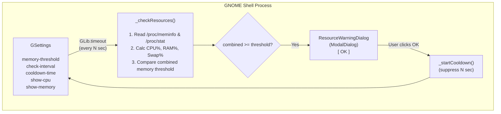

# Development Guide — Resource Guard

> Comprehensive guide for developing, debugging, and contributing to the **Resource Guard** GNOME Shell extension.

---

## Prerequisites

| Requirement              | Version        | Notes                                                |
| ------------------------ | -------------- | ---------------------------------------------------- |
| **GNOME Shell**          | 45, 46, 47, 48 | Extension uses ESM module system (GNOME 45+)         |
| **GJS**                  | ≥ 1.76         | Ships with GNOME 45+                                 |
| **Linux Kernel**         | ≥ 3.14         | Required for `MemAvailable` field in `/proc/meminfo` |
| **libadwaita**           | ≥ 1.0          | Required for preferences UI (`Adw.SpinRow`)          |
| **glib-compile-schemas** | any            | Part of `glib2-dev` / `libglib2.0-dev` package       |

### Install Development Dependencies

```bash
# Fedora / RHEL
sudo dnf install gnome-shell gjs glib2-devel gnome-extensions-app

# Ubuntu / Debian
sudo apt install gnome-shell gjs libglib2.0-dev gnome-shell-extension-prefs

# Arch Linux
sudo pacman -S gnome-shell gjs glib2 gnome-extensions-app
```

> **No external JavaScript dependencies.** This extension runs entirely on GNOME Shell built-in libraries (`GLib`, `GObject`, `St`, `Clutter`, `Gio`, `Adw`, `Gtk`). There is no `node_modules`, no `package.json`, no bundler.

---

## Environment Setup

### 1. Clone and Link

```bash
# Clone the repository
git clone https://github.com/haiphamngoc-dev/resource-guard.git
cd resource-guard

# Compile the GSettings schema
glib-compile-schemas schemas/

# Symlink into GNOME's extension directory
ln -sf "$(pwd)" \
  ~/.local/share/gnome-shell/extensions/resource-guard@haiphamngoc.dev
```

### 2. Enable the Extension

```bash
# Restart GNOME Shell first:
#   • Wayland: Log out → Log back in
#   • X11:     Alt+F2 → type 'r' → Enter

# Then enable
gnome-extensions enable resource-guard@haiphamngoc.dev
```

### 3. Verify Installation

```bash
gnome-extensions info resource-guard@haiphamngoc.dev
```

---

## Architecture Overview



### Process Isolation

- `extension.js` runs in the `gnome-shell` main process. It handles hardware telemetry reading, panel widgets, and modal dialogues. It has access to `St` and `Clutter` but **cannot** import Gtk/Adw.
- `prefs.js` runs in a separate process (`gnome-extensions-app`). It handles preferences configuration and utilizes `Adw` and `Gtk` widgets. It **cannot** import St/Clutter.
- The two processes communicate exclusively via **GSettings**.

---

## Development Workflow

### Recompile GSettings Schema

Every time you modify the XML schema under `schemas/`, you must compile it:

```bash
glib-compile-schemas schemas/
```

Commit both the `.gschema.xml` and the compiled `gschemas.compiled` files to the repository.

### Reloading Extensions for Debugging

#### Option A: Wayland Session (Standard)
GNOME Shell on Wayland does not support dynamic extension reloads. You must log out of your session and log back in to reload modifications in `extension.js`.

#### Option B: Nested GNOME Shell (Recommended)
You can launch a nested GNOME Shell session in a window to test changes dynamically without logging out:

```bash
dbus-run-session -- gnome-shell --nested --wayland
```

#### Option C: Looking Glass
Press `Alt+F2`, type `lg`, and hit Enter. You can view errors, look at logs, or dynamically reload styling contexts using:
```javascript
St.ThemeContext.get_for_stage(global.stage).get_theme().load_stylesheet(Gio.File.new_for_path('/path/to/stylesheet.css'));
```

---

## Debugging Logs

You can watch logs printed by GJS using `journalctl`:

```bash
# View real-time logs
journalctl -f -o cat /usr/bin/gnome-shell

# Filter specifically for Resource Guard logs
journalctl -f -o cat /usr/bin/gnome-shell | grep -i "ResourceGuard"
```

---

## Resource Management Checklist

To prevent shell crashes and memory leaks:
1. Ensure all signals connected to settings or global shell modules are disconnected in `disable()`.
2. Clear and remove all GLib timeouts/intervals using `GLib.source_remove(sourceId)` and reset their IDs to `0` in `disable()`.
3. Nullify large data references (`this._settings = null`, `this._lastCpuSample = null`).
4. Destroy panel widgets using `this._indicator.destroy()` and set references to `null`.
