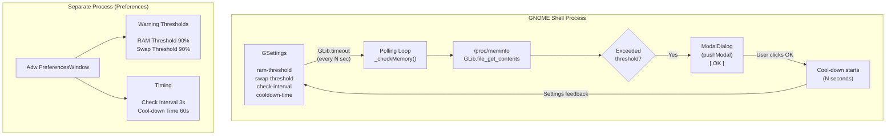
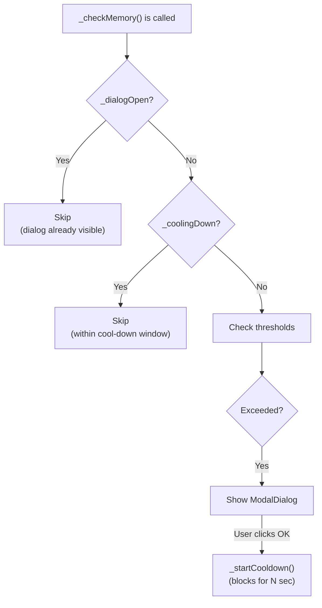

# System Memory Guard

[](https://extensions.gnome.org/)
[](LICENSE)
[](https://gjs.guide/extensions/upgrading/gnome-shell-45.html)

> A GNOME Shell extension that monitors RAM and Swap usage in real-time and displays a **blocking modal dialog** when memory consumption exceeds user-defined thresholds — preventing accidental system freezes before they happen.

<p align="center">
  
</p>

---

## Features

| Feature                    | Description                                                                                                        |
| -------------------------- | ------------------------------------------------------------------------------------------------------------------ |
| **Real-time Monitoring**   | Periodically reads `/proc/meminfo` to track RAM and Swap usage with zero external dependencies                     |
| **Modal Warning Dialog**   | Full-screen blocking dialog (`pushModal`) that grabs all keyboard & mouse focus — the user **must** acknowledge it |
| **Independent Thresholds** | Configure RAM and Swap warning levels separately (50%-100%)                                                        |
| **Anti-spam Protection**   | Built-in cool-down timer prevents repeated dialog popups when memory stays above threshold                         |
| **Native Preferences UI**  | Modern libadwaita settings window integrated with GNOME's extension manager                                        |
| **Clean Lifecycle**        | Proper `enable()`/`disable()` management — no memory leaks, no orphaned timers                                     |

---

## Architecture



---

## Project Structure

```text
memory-guard/
├── metadata.json          # Extension identity, UUID, GNOME version compatibility
├── extension.js           # Core logic: polling, memory calculation, modal dialog
├── prefs.js               # Preferences UI (libadwaita / Gtk4)
├── stylesheet.css         # Custom St (Shell Toolkit) styles for the dialog
├── schemas/
│   ├── org.gnome.shell.extensions.memory-guard.gschema.xml  # GSettings schema
│   └── gschemas.compiled  # Compiled binary (auto-generated)
└── README.md              # This file
```

---

## Installation

### Method 1 — Manual Install (Recommended for Development)

```bash
# 1. Clone the repository
git clone https://github.com/haiphamngoc-dev/memory-guard.git
cd memory-guard

# 2. Compile the GSettings schema
glib-compile-schemas schemas/

# 3. Create a symlink to the GNOME extensions directory
ln -sf "$(pwd)" \
  ~/.local/share/gnome-shell/extensions/memory-guard@haiphamngoc.dev

# 4. Restart GNOME Shell
#    ● Wayland: Log out → Log back in
#    ● X11:     Alt+F2 → type 'r' → Enter

# 5. Enable the extension
gnome-extensions enable memory-guard@haiphamngoc.dev
```

### Method 2 — Copy Install

```bash
# 1. Copy all files to the extensions directory
mkdir -p ~/.local/share/gnome-shell/extensions/memory-guard@haiphamngoc.dev
cp -r ./* ~/.local/share/gnome-shell/extensions/memory-guard@haiphamngoc.dev/

# 2. Restart GNOME Shell (same as above)

# 3. Enable
gnome-extensions enable memory-guard@haiphamngoc.dev
```

### Method 3 — Package as .zip (For Distribution)

```bash
# Create a distributable archive
zip -r memory-guard@haiphamngoc.dev.zip \
  metadata.json extension.js prefs.js stylesheet.css schemas/

# Install from the zip file
gnome-extensions install memory-guard@haiphamngoc.dev.zip
```

---

## ⚙️ Configuration

Open the preferences window using any of these methods:

```bash
# Via command line
gnome-extensions prefs memory-guard@haiphamngoc.dev

# Or use GNOME Extensions app / Extension Manager
```

### Settings Reference

| Setting            | Key              | Type  | Default | Range  | Description                                          |
| ------------------ | ---------------- | ----- | ------- | ------ | ---------------------------------------------------- |
| **RAM Threshold**  | `ram-threshold`  | `int` | `90`    | 50-100 | Warning triggers when RAM usage ≥ this percentage    |
| **Swap Threshold** | `swap-threshold` | `int` | `90`    | 50-100 | Warning triggers when Swap usage ≥ this percentage   |
| **Check Interval** | `check-interval` | `int` | `3`     | 1-30   | Seconds between each `/proc/meminfo` read            |
| **Cool-down Time** | `cooldown-time`  | `int` | `60`    | 10-600 | Seconds to suppress new dialogs after dismissing one |

### CLI Configuration (via `gsettings`)

```bash
# View all current settings
gsettings --schemadir schemas/ list-recursively \
  org.gnome.shell.extensions.memory-guard

# Set RAM threshold to 85%
gsettings --schemadir schemas/ set \
  org.gnome.shell.extensions.memory-guard ram-threshold 85

# Set check interval to 5 seconds
gsettings --schemadir schemas/ set \
  org.gnome.shell.extensions.memory-guard check-interval 5

# Reset all settings to defaults
gsettings --schemadir schemas/ reset-recursively \
  org.gnome.shell.extensions.memory-guard
```

---

## Technical Deep-Dive

### How Memory Usage is Calculated

The extension reads `/proc/meminfo` directly via `GLib.file_get_contents()` — no external libraries required. It parses four key fields:

```text
MemTotal:       16384000 kB    ← Total physical RAM
MemAvailable:    4096000 kB    ← Available RAM (accounts for buffers/cache)
SwapTotal:       8192000 kB    ← Total swap space
SwapFree:        1024000 kB    ← Free swap space
```

**RAM Used %** is calculated as:

```text
RAM% = (MemTotal - MemAvailable) / MemTotal × 100
```

> **Why `MemAvailable` instead of `MemFree`?**  
> `MemFree` only shows completely unused memory. `MemAvailable` (added in Linux 3.14) is a kernel estimate that includes reclaimable buffers and cache, giving a much more accurate picture of how much memory is truly in use.

**Swap Used %** is calculated as:

```text
Swap% = (SwapTotal - SwapFree) / SwapTotal × 100
```

If the system has no swap configured (`SwapTotal = 0`), swap monitoring is automatically skipped.

### Anti-Spam Protection (Cool-down Mechanism)

Three independent guards prevent dialog flooding:



1. **`_dialogOpen` flag** — no new dialog while one is already visible on screen
2. **`_coolingDown` flag** — no new dialog within the cool-down window after dismissal
3. **`destroyOnClose: true`** — dialog is fully destroyed after close, preventing stale GObject references

### Modal Dialog Behavior

The warning dialog extends `ModalDialog.ModalDialog` from GNOME Shell's internal UI library. When opened:

- `pushModal()` is called, which **grabs all keyboard and pointer input**
- A semi-transparent lightbox overlay covers the entire screen
- The user **cannot** click on any window, switch workspaces, or interact with the desktop
- The **only** way to dismiss is clicking the "OK" button
- After dismissal, `popModal()` releases the input grab and the cool-down timer begins

### Lifecycle Management

```javascript
enable()                          disable()
   │                                  │
   ├── Load GSettings                 ├── _stopLoop()
   ├── Initialize state flags         │     └── GLib.source_remove(loopSourceId)
   └── _startLoop()                   ├── _clearCooldown()
         └── GLib.timeout_add_seconds │     └── GLib.source_remove(cooldownSourceId)
              (repeating timer)       ├── Close any open dialog
                                      └── Null all references
```

Every `GLib.timeout_add_seconds()` call stores its source ID, and `disable()` removes **all** sources via `GLib.source_remove()`. This is critical because:

- GNOME Shell calls `disable()` when the screen locks (GNOME 42+)
- Orphaned timers would continue running, consuming CPU and potentially crashing the shell
- Unreferenced GObject instances can cause memory leaks in GJS

---

## Development & Debugging

### Watch Extension Logs

```bash
# Follow GNOME Shell logs in real-time
journalctl -f -o cat /usr/bin/gnome-shell

# Filter only Memory Guard messages
journalctl -f -o cat /usr/bin/gnome-shell | grep -i "MemoryGuard"
```

### Test the Warning Dialog

Temporarily lower the threshold to trigger the dialog without actually running out of memory:

```bash
# Set threshold to 1% (will trigger immediately)
gsettings --schemadir schemas/ set \
  org.gnome.shell.extensions.memory-guard ram-threshold 1

# After testing, reset to default
gsettings --schemadir schemas/ set \
  org.gnome.shell.extensions.memory-guard ram-threshold 90
```

### Recompile Schema After Changes

```bash
glib-compile-schemas schemas/
```

### Validate Extension Metadata

```bash
# Check if the extension is recognized by GNOME
gnome-extensions info memory-guard@haiphamngoc.dev

# List all installed extensions
gnome-extensions list --details
```

### Nested GNOME Shell (X11 Only)

For rapid iteration without logging out, run a nested GNOME Shell session:

```bash
dbus-run-session -- gnome-shell --nested --wayland
```

### Looking Glass (Built-in Debugger)

Press `Alt+F2`, type `lg`, and press Enter to open GNOME Shell's built-in JavaScript debugger. Useful for inspecting live extension state.

---

## File Reference

### `metadata.json`

Declares the extension's identity and compatibility:

| Field             | Value                                             | Purpose                                    |
| ----------------- | ------------------------------------------------- | ------------------------------------------ |
| `name`            | System Memory Guard                               | Display name in GNOME Extensions app       |
| `uuid`            | `memory-guard@haiphamngoc.dev`                    | Unique identifier, also the directory name |
| `shell-version`   | `["45", "46", "47", "48"]`                        | Compatible GNOME Shell versions            |
| `settings-schema` | `org.gnome.shell.extensions.memory-guard`         | Links to the GSettings schema              |
| `url`             | `https://github.com/haiphamngoc-dev/memory-guard` | Project homepage                           |

### `extension.js`

| Class / Function                        | Responsibility                                                                                                                                                     |
| --------------------------------------- | ------------------------------------------------------------------------------------------------------------------------------------------------------------------ |
| `MemoryWarningDialog`                   | Extends `ModalDialog.ModalDialog`. Builds the warning UI with icon, title, body text, and percentage display. Single "OK" button dismisses and triggers cool-down. |
| `MemoryGuardExtension`                  | Main `Extension` subclass. Manages the complete lifecycle.                                                                                                         |
| `enable()`                              | Loads settings, initializes state, starts polling loop                                                                                                             |
| `disable()`                             | Removes all GLib sources, closes dialogs, nulls references                                                                                                         |
| `_startLoop()` / `_stopLoop()`          | Manages the repeating `GLib.timeout_add_seconds` timer                                                                                                             |
| `_readMeminfo()`                        | Reads and parses `/proc/meminfo` via `GLib.file_get_contents`                                                                                                      |
| `_checkMemory()`                        | Core logic: compute usage %, compare thresholds, guard against duplicates                                                                                          |
| `_showWarningDialog()`                  | Creates and opens the modal dialog                                                                                                                                 |
| `_startCooldown()` / `_clearCooldown()` | One-shot timer to suppress new dialogs after dismissal                                                                                                             |

### `prefs.js`

| Class / Function          | Responsibility                                                                                           |
| ------------------------- | -------------------------------------------------------------------------------------------------------- |
| `MemoryGuardPreferences`  | Extends `ExtensionPreferences`. Runs in a separate process from the shell.                               |
| `fillPreferencesWindow()` | Builds 2 groups of `Adw.SpinRow` widgets bound directly to GSettings via `Gio.SettingsBindFlags.DEFAULT` |

### `stylesheet.css`

| CSS Class               | Applied To                                      |
| ----------------------- | ----------------------------------------------- |
| `.memory-guard-dialog`  | Dialog container — padding override             |
| `.memory-guard-icon`    | Warning icon — 64px, red (#e74c3c)              |
| `.memory-guard-title`   | Title label — 18pt bold, red                    |
| `.memory-guard-body`    | Body text — 11pt, light gray (#deddda)          |
| `.memory-guard-percent` | Usage percentages — 13pt bold, yellow (#f9e44c) |

---

## Requirements

| Requirement  | Version                                        |
| ------------ | ---------------------------------------------- |
| GNOME Shell  | 45, 46, 47, or 48                              |
| GJS          | ≥ 1.76 (ships with GNOME 45+)                  |
| Linux Kernel | ≥ 3.14 (for `MemAvailable` in `/proc/meminfo`) |
| libadwaita   | ≥ 1.0 (for preferences UI)                     |

> **No external dependencies required.** The extension reads `/proc/meminfo` directly via GLib — no `libgtop`, `python`, or additional packages needed.

---

## Contributing

1. Fork the repository
2. Create a feature branch: `git checkout -b feature/my-feature`
3. Make your changes and test thoroughly
4. Commit with a descriptive message: `git commit -m "feat: add feature description"`
5. Push to your fork: `git push origin feature/my-feature`
6. Open a Pull Request

### Commit Convention

This project follows [Conventional Commits](https://www.conventionalcommits.org/):

| Prefix      | Usage                                                   |
| ----------- | ------------------------------------------------------- |
| `feat:`     | New feature                                             |
| `fix:`      | Bug fix                                                 |
| `docs:`     | Documentation only                                      |
| `style:`    | CSS / formatting changes                                |
| `refactor:` | Code change that neither fixes a bug nor adds a feature |
| `chore:`    | Build process, CI, or tooling changes                   |

---

## License

This project is licensed under the [GNU General Public License v3.0](LICENSE).

---
