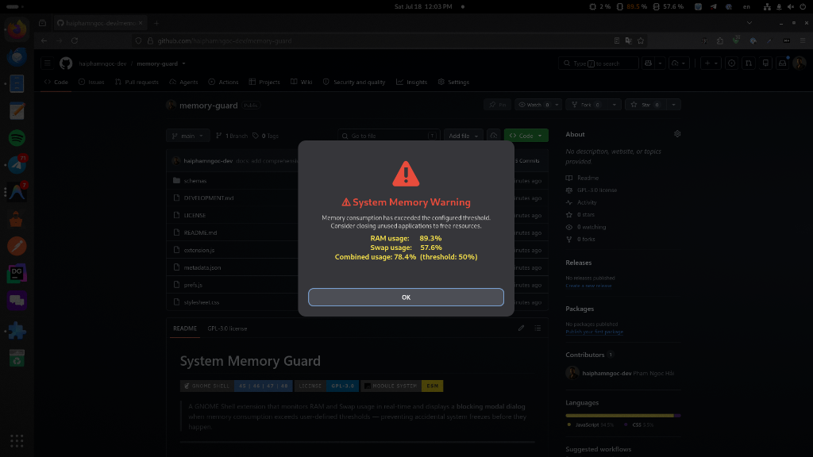
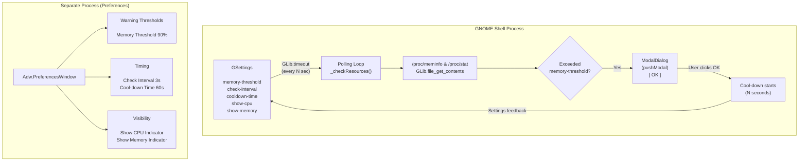

# Resource Guard

[](https://extensions.gnome.org/)
[](LICENSE)
[](https://gjs.guide/extensions/upgrading/gnome-shell-45.html)

> A GNOME Shell extension that monitors CPU, RAM, and Swap usage in real-time. Displays side-by-side indicators in the top panel and pops a **blocking modal dialog** when memory consumption exceeds user-defined thresholds — preventing accidental system freezes.

<p align="center">
  
</p>

---

## Features

| Feature                    | Description                                                                                                        |
| -------------------------- | ------------------------------------------------------------------------------------------------------------------ |
| **Real-time Monitoring**   | Periodically reads `/proc/meminfo` and `/proc/stat` to track CPU, RAM, and Swap usage with zero external dependencies |
| **Dual Indicators**        | Displays CPU usage and Memory usage side-by-side in the top panel (e.g., `[CPU] 12%  [Mem] 75%`)                  |
| **Independent Settings**   | Independently toggle the CPU and Memory indicators on the panel using settings                                     |
| **Modal Warning Dialog**   | Full-screen blocking dialog (`pushModal`) that grabs keyboard & pointer focus when memory threshold is crossed     |
| **Anti-spam Protection**   | Built-in cool-down timer prevents repeated memory dialog popups when consumption stays high                       |
| **Native Preferences UI**  | Modern libadwaita settings window integrated with GNOME's extension manager                                        |
| **Clean Lifecycle**        | Proper `enable()`/`disable()` management — no memory leaks, no orphaned timers                                     |

---

## Architecture



---

## Installation

### Method 1 — Manual Install (Recommended for Development)

```bash
# 1. Clone the repository
git clone https://github.com/haiphamngoc-dev/resource-guard.git
cd resource-guard

# 2. Compile the GSettings schema
glib-compile-schemas schemas/

# 3. Create a symlink to the GNOME extensions directory
ln -sf "$(pwd)" \
  ~/.local/share/gnome-shell/extensions/resource-guard@haiphamngoc.dev

# 4. Restart GNOME Shell
#    ● Wayland: Log out → Log back in
#    ● X11:     Alt+F2 → type 'r' → Enter

# 5. Enable the extension
gnome-extensions enable resource-guard@haiphamngoc.dev
```

### Method 2 — Copy Install

```bash
# 1. Copy all files to the extensions directory
mkdir -p ~/.local/share/gnome-shell/extensions/resource-guard@haiphamngoc.dev
cp -r ./* ~/.local/share/gnome-shell/extensions/resource-guard@haiphamngoc.dev/

# 2. Restart GNOME Shell

# 3. Enable
gnome-extensions enable resource-guard@haiphamngoc.dev
```

### Method 3 — Package as .zip (For Distribution)

```bash
# Create a distributable archive
zip -r resource-guard@haiphamngoc.dev.zip \
  metadata.json extension.js prefs.js stylesheet.css schemas/

# Install from the zip file
gnome-extensions install resource-guard@haiphamngoc.dev.zip
```

---

## ⚙️ Configuration

Open the preferences window using any of these methods:

```bash
# Via command line
gnome-extensions prefs resource-guard@haiphamngoc.dev

# Or use GNOME Extensions app / Extension Manager
```

### Settings Reference

| Setting            | Key                | Type   | Default | Range  | Description                                          |
| ------------------ | ------------------ | ------ | ------- | ------ | ---------------------------------------------------- |
| **Memory Threshold**| `memory-threshold` | `int`  | `90`    | 50-100 | Warning triggers when combined memory usage ≥ this % |
| **Check Interval** | `check-interval`   | `int`  | `3`     | 1-30   | Seconds between each statistics sample               |
| **Cool-down Time** | `cooldown-time`    | `int`  | `60`    | 10-600 | Seconds to suppress warning dialogs after dismissal  |
| **Show CPU**       | `show-cpu`         | `bool` | `true`  | -      | Show CPU usage percentage in the top panel           |
| **Show Memory**    | `show-memory`      | `bool` | `true`  | -      | Show memory usage percentage in the top panel        |

### CLI Configuration (via `gsettings`)

```bash
# View all current settings
gsettings --schemadir schemas/ list-recursively \
  org.gnome.shell.extensions.resource-guard

# Set memory threshold to 85%
gsettings --schemadir schemas/ set \
  org.gnome.shell.extensions.resource-guard memory-threshold 85

# Set check interval to 5 seconds
gsettings --schemadir schemas/ set \
  org.gnome.shell.extensions.resource-guard check-interval 5

# Reset all settings to defaults
gsettings --schemadir schemas/ reset-recursively \
  org.gnome.shell.extensions.resource-guard
```

---

## Technical Deep-Dive

### How CPU Usage is Calculated

The extension reads `/proc/stat` directly via GIO async operations. It splits and parses the first line (`cpu`), comparing aggregate tick readings with the previous sample:

```text
idle = idle_ticks + iowait_ticks
total = sum(all_ticks)

deltaTotal = total - lastTotal
deltaIdle = idle - lastIdle

CPU% = (deltaTotal - deltaIdle) / deltaTotal * 100
```

### How Memory Usage is Calculated

The extension reads `/proc/meminfo` and parses four key fields:

```text
MemTotal:       16384000 kB    ← Total physical RAM
MemAvailable:    4096000 kB    ← Available RAM (reclaimable cache & buffers)
SwapTotal:       8192000 kB    ← Total swap space
SwapFree:        1024000 kB    ← Free swap space
```

```text
RAM_used = MemTotal - MemAvailable
Swap_used = SwapTotal - SwapFree
Combined% = (RAM_used + Swap_used) / (MemTotal + SwapTotal) * 100
```

If the system has no swap configured (`SwapTotal = 0`), swap monitoring is automatically skipped in combined calculation.

---

## Requirements

| Requirement  | Version                                        |
| ------------ | ---------------------------------------------- |
| GNOME Shell  | 45, 46, 47, or 48                              |
| GJS          | ≥ 1.76 (ships with GNOME 45+)                  |
| Linux Kernel | ≥ 3.14 (for `MemAvailable` in `/proc/meminfo`) |
| libadwaita   | ≥ 1.0 (for preferences UI)                     |

---

## License

This project is licensed under the [GNU General Public License v3.0](LICENSE).
